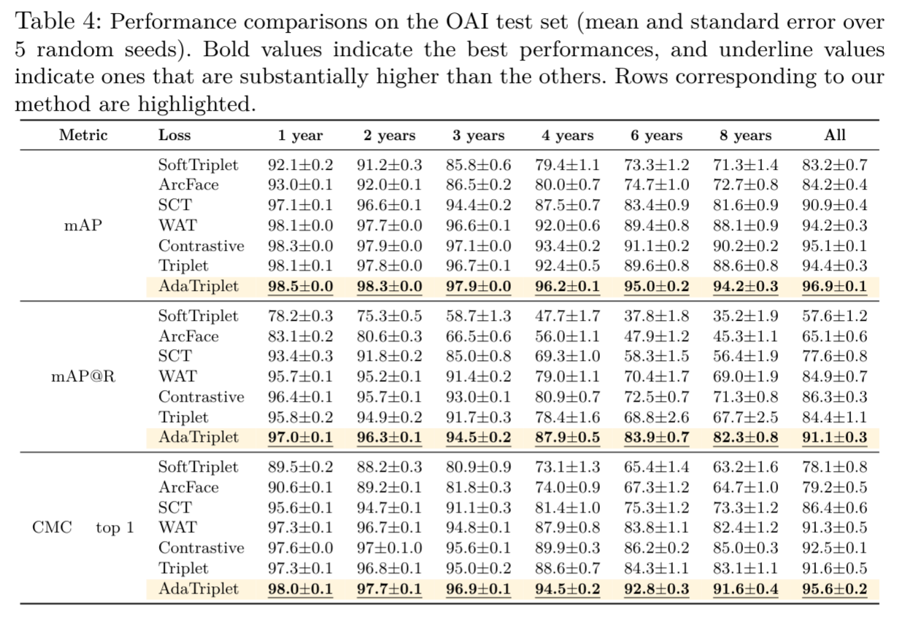

# AdaTriplet

## Dependencies

We provide file `environment.yml` for dependencies

## Installation

      conda env create -f environment.yml
      conda activate AdaTriplet
      cd AdaTriplet/
      pip install -e .

## Experiments

### Dataset

1. Knee X-ray: Download the OAI dataset via https://nda.nih.gov/oai/.
2. Chest X-ray: Download the ChestXrays-14 dataset at https://nihcc.app.box.com/v/ChestXray-NIHCC/ 
3. Create the image folder `./ResizedImages_{OAI|CXR}`

### Training

Run the script as follows:

      python train.py data_type=<OAI|CXR> \ 
            image_crop_path=<path-to-ResizedImages> \  
            image_raw_path=<path-to-folder-of-raw-images> \
            metadatapath=<path-to-meta-data> \
            datapath=<path-to-dataframe> \
            method=<method_name>

Our code supports 8 `method_name`s: 
1. `AdaTriplet-AM` : AdaTriplet loss with AutoMargin selection
2. `AdaTriplet`
3. `Triplet-AM`: Triplet loss with AutoMargin selection
4. `Triplet`
5. `SCT`
6. `WAT`
7. `ArcFace`
8. `SoftTriplet`

###Test

Run the script as follows:

      python test.py data_type=<OAI|CXR> 
      query_time=<time-in-months|all>
      pretrained_matching_model_folder_path=<path-to-folder-of-trained-models>

## Results

## Forensic Matching Results
